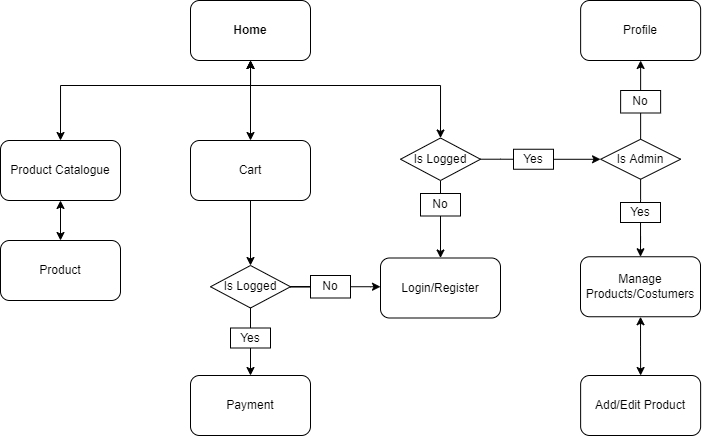

# Gaming Gem

- Pedro Lucas de Moliner de Castro - 11795784
- João Guilherme Jarochinski Marinho - 10698193


## 1. Requirements

The assignment is to build an online store and the products chosen to be sold are **computer components** and **peripherals**. The application must have two types of users (**customers** and **administrators**), a cart system and accept payments with credit cards. An extra functionality is also required so a **search bar** and a **categories menu** were added. Lastly, the system should provide accessibility requirements, good usability and be responsive.

- **User Information:** ID, name, password, email, phone, address and if is admin.
- **Product Information:** ID, name, category, summary, description, quantity, price and image.
- **Purchase Information:** ID, user, date, total price and a list of the products with ID, quantity and price paid.

> In the initial database entries there are 2 created accounts (`client@client.com/client` and `admin@admin.com/admin`), 5 products and 1 purchase.


## 2. Project Description

**Gaming Gem** is an online computer components and peripherals store focused on hardware for gaming. The website will be presented as a Single Page Application and its full Mockup can be seen in [Figma](https://www.figma.com/file/ozZUSnOeuyotmszMJvDc2P/Vuetify-Components-(Community)?node-id=13144%3A605) on the "Store" page. A partial interactive one, including Login/Register, Home and Product Description, can be found in [Github Pages](https://pedrolmcastro.github.io/store/mockup/pages/home.html) and its source code in the [/mockup](https://github.com/pedrolmcastro/store/tree/main/mockup) directory.

- **Sections:** Login/Register, Home, Product Catalogue, Product Description, Cart, Payment, Profile, Manage Products/Users and Add/Edit Product.



> The above Navigation Diagram refers to the original plan in the mockup phase, since then one change has been made were the admin route for the Manage Products/Costumers page is separated from the one linking users to their profiles.


## 3. Comments About the Code

The client side was developed using Vue 3 with the following project structure: `App.vue` has the app template and general CSS styles, `Store.vue` holds global variables/functions and custom components are located under the `components/` or `pages/` directories.

The server side was implemented using Node and Express with MongoDB as the database management system, having the files at `models/` serving as the schemas and `scripts/populate.js` beign the initial data generator. The files under `routers/` specify the connection points and their actions, limiting the access to some of them using the auxiliar functions defined in the files inside `auth/`.


## 4. Test Plan

1. Click the **User Icon** and try to login with incorrect information: empty email, empty password, invalid email, unknown user or incorrect password.
1. Click on **Register** and try to create an account with incorrect information: empty name, empty email, empty password, empty confirmation password, invalid phone, invalid email, different password and confirmation or email already used.
1. Click the **Cart Icon**, verify that the cart is empty and hit the **Log In** link, use email "client@client.com" and password "client" to log in and go back to the cart.
1. Search for "5" in the **Search Bar** located in the **Navigation Header** and use the **Order By** selecting to order the products by price.
1. Click in the "Intel I5 11400F" image to go to the **Product Page** and click the **Buy Button**, after the alert hit the button once more.
1. Click the **Title** to go to the **Home Page** and hit the **Add To Cart Button** in the "Ryzen R5 3600X" product card.
1. Go to the cart, click the **Minus Button** in the "Ryzen R5 3600X" item, hit **Cancel** in the confirmation popup and repeat the process but clicking **Ok** this time.
1. Click the **Plus Button** in the "Intel I5 11400F" item multiple times and then hit the **Checkout Button**.
1. Try to validate with incorrect information: empty address, empty name, empty number, empty CVV, empty expiration, invalid number, invalid CVV, invalid expiration or expired date.
1. Use address "Clients Street, 1 - Clientland - CL", name "Client", number "1234 1234 1234 1234", CVV "123" and expiration date "12/25", click the **Validate** button and then hit the **Confirm Button**.
1. Click the **User Icon** to go to the **Profile Page**, check the **Purchases Section** and hit the **Log Out Button**.
1. Register an account with name "New", empty address, empty phone, email "new@new.com", password "new" and confirmation password "new", go to the **Profile Page**, check the **Purchases Section** and hit the **Log Out Button**.
1. Use email "admin@admin.com" and password "admin" to log in, click the **Settings Icon** and navigate between the **Products Section** and the **Users Section**.
1. Make the user "New" an admin, click the **Delete Icon** to delete the user "Client" and hit **Ok**.
1. Click the **Delete Icon** in the "Ryzen R5 3600X" product listing and confirm, then hit the **Edit Icon** of the "Intel I5 11400F", raise its quantity to 3 and go to the **Home Page**.
1. Log out, try to log in with email "client@client.com" and password "client" and log in using email "new@new.com" and password "new".
1. Click the **Settings Icon** and hit the **Add Product Button**, inform the name "Mouse", the quantity 1, the price 10000 and the category "Mouse" and upload an image by hiting the default image, click the **Save Button**, open the **Burger Menu** and select the **Mouse Link** under the **Peripherals Division**.
1. Reaload the webpage and explore all the previously visited sections.


## 5. Test Results

1. An error message will appear between the input fields and the **Log In Button** informing the problem.
1. An error message will appear between the input fields and the **Register Button** informing the problem.
1. Both times the **Checkout Button** will be disabled because the cart is empty, but only the first time the message asking for the login will be present.
1. The "Intel I5 11400F", "Gigabyte B450M-DS3H" and "Ryzen R5 3600X" products will be displayed in order.
1. First, the message "Product Intel I5 11400F added to the cart" will be alerted and in the second time the message will be "Product Intel I5 11400F already added to the cart".
1. The message "Product Ryzen R5 3600X added to the cart" will be alerted.
1. The "Ryzen R5 3600X" product will be removed from the cart and the total value updated only after the confirmed operation.
1. The quantity of "Intel I5 11400F" items will be capped at 5 and the **Checkout** step will be displayed with the address filled in with "Clients Street, 1 - Clientland - CL".
1. An error message will appear between the input fields and the **Validate Button** informing the problem.
1. The informed address and card information will be displayed in the **Confirmation** step and the "Intel I5 11400F" product will no longer be on the **Home Page**.
1. There will be two purchases, the first in "01/01/2001" with 1 "Intel I5 11400F" and 2 "Asrock H110M-HG4" totalling $350.00 and the other in the current date with 5 "Intel I5 11400F" summing to $750.00.
1. The only displayed information will be the name "New", a random id and the email "new@new.com" with no purchases.
1. 5 Products will be displayed in the **Products Section** and 3 users will appear in the **Users Section**, only one of them being an admin.
1. A confirmation message "User Client will be deleted." will be alerted and the user "Client" will disappear from the listing.
1. The "Intel I5 11400F" product will once again be displayed in the **Home Page** but this time the "Ryzen R5 3600X" won't be there.
1. The error message "Sorry, the user informed was not found." will appear in the first attempt and the **Settings Icon** will now be displayed for the user "New".
1. The image in the **Edit Section** won't change, but after saving the "Mouse" product will be displayed with the data informed.
1. All changed content will remain modified since the changes were applied in the server.

> **Note:** to reset the data to its original state, close the server, rerun the populate script and start the server once again. 


## 6. Build Procedures

First, make sure you have the project dependecies installed: [node](https://nodejs.org/en/download/), [npm](https://docs.npmjs.com/downloading-and-installing-node-js-and-npm) and [docker](https://docs.docker.com/engine/install/). Configure the docker and run the server side with the following commands:

```shell
cd backend/
npm install

docker run -d -p 27017:27017 --name vue-mongo -e MONGO_INITDB_ROOT_USERNAME=admin -e MONGO_INITDB_ROOT_PASSWORD=admin mongo
docker start vue-mongo # Use this instead, if you previously created the instance

npm run populate
npm start
```

Now open the `frontend/dist/index.html` file in your browser to see the application running. To terminate the execution hit `Ctrl + C` in your server terminal.


## 7. Problems

During the frontend development, the group noticed that implementing a generic filter that worked with any product category would be outside of the scope of the project, so the bonus feature was reduced to be only the search by name/category. Also, Vuetify is not yet fully supported in Vue 3 so the [Font Awesome](https://fontawesome.com/), [Maska](https://github.com/beholdr/maska), [Toggle](https://github.com/vueform/toggle), [VueCollapsiblePanel](https://github.com/dafcoe/vue-collapsible-panel) and [VueBurgerMenu](https://github.com/mbj36/vue-burger-menu) libraries were used as replacements.


## 8. Comments

No comments.
